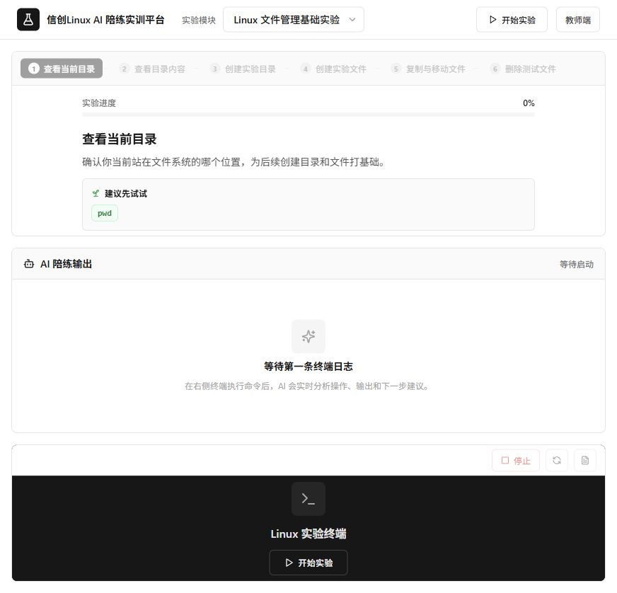
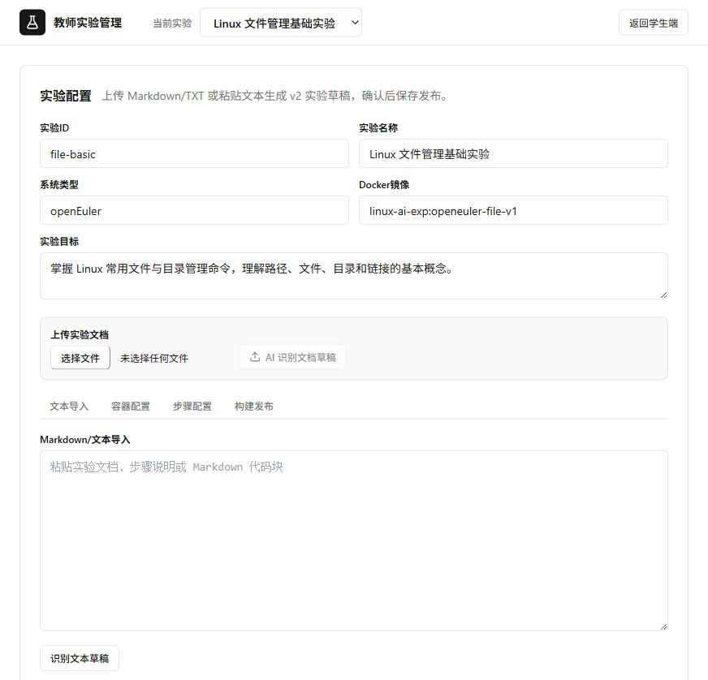

# 信创 Linux AI 实时陪练实训平台

<p align="center">
  
</p>

<p align="center">
  基于真实案例的 Linux 操作系统配置与管理课程实训平台。
  <br>
  融合 AI 智能陪练与 Web 终端实操，在真实系统环境中做中学、学中做。
</p>

<p align="center">
  <a href="https://wisdomh5.zhihuishu.com/course/index/2000879101413748736?courseId=1100001801&mapVersion=0" target="_blank">
    
  </a>
  
  
</p>

---

## 核心特性

### 真实系统环境
- 浏览器内直接连接真实的 **openEuler** / **Kylin** 等国产操作系统
- 基于 Docker 容器化技术，秒级启动，零配置
- 所有命令在真实系统执行，产生实际效果

### AI 智能陪练
- 卡壳时给出**引导性提示**，不直接给答案
- 命令出错时实时**诊断原因**，培养独立排查能力
- 支持 **DeepSeek** 大模型和 Mock 模式两种 AI 引擎

### 任务驱动学习
- **20+ 真实案例实验**：文件管理、网络配置、Shell 编程、Web 服务器、数据库、DNS、Docker 容器等
- 每步实验包含：目标、指令、参考命令、成功标准、AI 指导重点
- **自动校验**：系统实时检查命令和输出是否符合预期

### 教师管理后台
- 查看全班学生实验进度、能力评分和完成情况
- 自定义实验内容、配置任务步骤和验证规则
- AI 辅助导入实验内容

---

## 技术架构

```
┌─────────────────────────────────────────────────────────┐
│                      前端 (React 19)                      │
│  ┌──────────────┐  ┌──────────────┐  ┌──────────────┐   │
│  │  Landing Page │  │ StudentPage  │  │ TeacherPage  │   │
│  │  ( visitors   │  │  Web 终端   │  │  实验管理   │   │
│  │   风格设计 )  │  │  AI 陪练    │  │  进度追踪   │   │
│  └──────────────┘  └──────────────┘  └──────────────┘   │
│                         Vite + TailwindCSS               │
└─────────────────────────┬───────────────────────────────┘
                          │ REST API / WebSocket
┌─────────────────────────┴───────────────────────────────┐
│                    后端 (FastAPI)                         │
│  ┌────────────┐  ┌────────────┐  ┌────────────┐         │
│  │  实验管理   │  │  AI 陪练    │  │  自动校验   │         │
│  │  Session   │  │  Coach     │  │  Verify    │         │
│  │  配置解析   │  │  DeepSeek  │  │  command   │         │
│  └────────────┘  │  / Mock    │  │  _match    │         │
│                  └────────────┘  └────────────┘         │
│                         Docker Manager                    │
└─────────────────────────┬───────────────────────────────┘
                          │
┌─────────────────────────┴───────────────────────────────┐
│              Docker 容器 (openEuler / Kylin)              │
│         真实 Linux 环境，多用户并发隔离运行                 │
└─────────────────────────────────────────────────────────┘
```

---

## 目录结构

```text
platform/
├── backend/                    # FastAPI 后端
│   ├── app/
│   │   ├── main.py            # 主入口
│   │   ├── experiments.py     # 实验配置加载与解析
│   │   ├── experiment_designer.py  # 实验设计器
│   │   ├── ai_provider.py     # AI 陪练引擎 (DeepSeek / Mock)
│   │   ├── docker_manager.py  # Docker 容器管理
│   │   ├── verification_service.py  # 步骤自动校验
│   │   ├── step_verifier.py   # 命令匹配验证
│   │   ├── websocket_manager.py     # WebSocket 终端通信
│   │   ├── report_service.py  # HTML 报告生成
│   │   ├── knowledge.py       # 轻量知识库
│   │   └── schemas.py         # Pydantic 数据模型
│   ├── tests/                 # 测试用例
│   └── requirements.txt
│
├── frontend/                   # React 19 前端
│   ├── src/
│   │   ├── pages/
│   │   │   ├── LandingPage.tsx      # 落地页
│   │   │   ├── StudentPage.tsx      # 学生实训端
│   │   │   └── TeacherPage.tsx      # 教师管理端
│   │   ├── components/
│   │   │   ├── landing/            # 落地页组件
│   │   │   ├── TerminalPanel.tsx   # Web 终端
│   │   │   ├── CoachPanel.tsx      # AI 陪练面板
│   │   │   ├── TaskPanel.tsx       # 任务面板
│   │   │   └── StepNav.tsx         # 步骤导航
│   │   ├── hooks/useApi.ts         # API 请求
│   │   ├── hooks/useWebSocket.ts   # WebSocket 终端
│   │   └── types/index.ts          # TypeScript 类型
│   └── package.json
│
├── experiments/                # 实验任务配置 (20+ JSON)
│   ├── linux-system-awareness.json
│   ├── linux-file-management.json
│   ├── linux-network-configuration.json
│   ├── shell-programming-intro.json
│   ├── web-server-configuration.json
│   ├── docker-container-management.json
│   └── ...
│
├── docker/                     # openEuler 实验镜像构建
├── knowledge/                  # 轻量知识库文档
├── docs/                       # 设计文档与规划
└── design.md                   # Landing Page 设计规范
```

---

## 快速开始

### 环境要求
- **Node.js** >= 20
- **Python** >= 3.11
- **Docker** >= 24（可选，用于真实容器模式）

### 1. 克隆仓库

```bash
git clone https://github.com/kangvcar/xinchuangLab.git
cd xinchuangLab
```

### 2. 配置环境变量

```bash
cp .env.example .env
```

编辑 `.env`，根据需要配置：

```text
# 运行模式: mock（默认，无需 Docker）或 docker（真实容器）
LAB_RUNTIME=mock

# AI 模式: auto / mock / deepseek
AI_MODE=mock

# 使用 DeepSeek 时填写
DEEPSEEK_API_KEY=your_api_key_here
DEEPSEEK_BASE_URL=https://api.deepseek.com
DEEPSEEK_MODEL=deepseek-chat

# 教师后台密码
ADMIN_PASSWORD=linuxai
```

### 3. 启动后端

```bash
cd backend
python -m venv venv
source venv/bin/activate  # Windows: venv\Scripts\activate
pip install -r requirements.txt
cd app
python -m uvicorn main:app --reload --reload-exclude generated/* --host 127.0.0.1 --port 8000
```

### 4. 启动前端

```bash
cd frontend
npm install
npm run dev
```

### 5. 访问平台

| 入口 | 地址 |
|------|------|
| 落地页 | http://localhost:5173 |
| 学生实训 | http://localhost:5173/lab |
| 教师后台 | http://localhost:5173/teacher |
| API 文档 | http://localhost:8000/docs |

---

## 阿里云 Ubuntu 24.04 部署

适用于无域名、直接使用服务器公网 IP 访问的部署方式。脚本会配置国内源、安装 Docker CE、安装 Node.js 20、配置 pip/npm 镜像、构建前端、创建后端 systemd 服务、配置 Nginx，并构建 `experiments/*.json` 中的全部实验容器镜像。

### 服务器安全组

在阿里云安全组放行：

| 用途 | 端口 |
|------|------|
| Web 访问 | `80/tcp` |
| 实验 Web 终端 | `20000-20999/tcp` |

如需改端口范围，部署时传入 `TERMINAL_PORT_START` 和 `TERMINAL_PORT_END`，并同步调整安全组。

### 一键部署

```bash
git clone https://github.com/kangvcar/xinchuangLab.git
cd xinchuangLab

# PUBLIC_HOST 填服务器公网 IP；ADMIN_PASSWORD 建议自行设置。
sudo -E PUBLIC_HOST=你的服务器公网IP \
  ADMIN_PASSWORD='请改成强密码' \
  bash scripts/deploy-aliyun-ubuntu24.sh
```

部署完成后访问：

| 入口 | 地址 |
|------|------|
| 平台首页 | `http://你的服务器公网IP` |
| 学生实训 | `http://你的服务器公网IP/lab` |
| 教师后台 | `http://你的服务器公网IP/teacher` |
| 健康检查 | `http://你的服务器公网IP/api/health` |

### 国内源与镜像加速

脚本默认使用：

| 类别 | 默认源 |
|------|--------|
| Ubuntu / Docker CE apt | `http://mirrors.cloud.aliyuncs.com` |
| pip | `http://mirrors.cloud.aliyuncs.com/pypi/simple` |
| npm | `https://registry.npmmirror.com` |
| Node.js 二进制包 | `https://npmmirror.com/mirrors/node` |
| openEuler 软件源 | `https://repo.huaweicloud.com/openeuler` |
| openEuler 基础镜像优先拉取 | `hub.oepkgs.net/openeuler/openeuler:22.03-lts-sp3` |

如果有阿里云个人 Docker Hub 加速器，可传入：

```bash
sudo -E PUBLIC_HOST=你的服务器公网IP \
  DOCKER_REGISTRY_MIRRORS='["https://你的ID.mirror.aliyuncs.com"]' \
  bash scripts/deploy-aliyun-ubuntu24.sh
```

重新构建所有实验镜像：

```bash
sudo -E PUBLIC_HOST=你的服务器公网IP FORCE_REBUILD_IMAGES=1 \
  bash scripts/deploy-aliyun-ubuntu24.sh --force-images
```

常用运维命令：

```bash
systemctl status xinchuang-lab
journalctl -u xinchuang-lab -f
docker images 'linux-ai-exp:*'
curl http://127.0.0.1:8000/api/health
```

---

## 实验模块（20+）

| 模块 | 实验名称 | 核心技能 |
|------|---------|---------|
| 基础操作 | Linux 系统认知 | 系统架构、发行版识别 |
| 基础操作 | Linux 文件管理 | 目录操作、文件查看、查找清理 |
| 基础操作 | Linux 文本处理 | grep、sed、awk |
| 基础操作 | Linux 用户管理 | 用户/组创建、权限分配 |
| 基础操作 | Linux 权限管理 | chmod、chown、ACL |
| 系统配置 | Linux 网络配置 | IP、路由、DNS、端口 |
| 系统配置 | Linux 软件包管理 | yum/dnf、源码安装 |
| 系统配置 | Linux 磁盘管理 | 分区、挂载、LVM |
| 系统配置 | Linux 安全管理 | 防火墙、SELinux |
| Shell 编程 | 正则表达式认知 | 元字符、匹配模式 |
| Shell 编程 | Shell 编程初探 | 变量、条件、循环 |
| Shell 编程 | Shell 编程实践 | 函数、脚本调试 |
| 服务运维 | Web 服务器配置 | Nginx/Apache |
| 服务运维 | 数据库服务器配置 | MySQL/MariaDB |
| 服务运维 | DNS 服务器配置 | BIND、区域文件 |
| 服务运维 | 邮件服务器配置 | Postfix/Dovecot |
| 容器技术 | Docker 镜像管理 | 构建、推送、拉取 |
| 容器技术 | Docker 容器管理 | 运行、端口映射、日志 |

---

## 系统截图

### 学生实训端

<p align="center">
  
</p>

- **左侧**：任务面板，显示当前步骤目标、指令和参考命令
- **右侧上方**：AI 陪练面板，实时分析终端输出并给出指导
- **右侧下方**：Web 终端，直接操作真实 Linux 系统

### 教师管理端

<p align="center">
  
</p>

- 实验列表管理、步骤可视化编辑器
- 学生进度追踪、能力评分
- AI 辅助导入实验内容

---

## 配套课程

本项目配套 **《Linux 操作系统配置与管理》** 精品在线课程：

- **5 大模块**：系统认知 → 系统配置 → Shell 编程 → 服务运维 → 容器技术
- **20+ 真实案例**：覆盖企业级 Linux 运维场景
- **64 学时**：理论与实践一体化教学
- **智慧树平台**：[点击访问课程](https://wisdomh5.zhihuishu.com/course/index/2000879101413748736?courseId=1100001801&mapVersion=0)

---

## 开发模式说明

### Mock 模式（默认）
无需 Docker，即可体验完整的 AI 陪练和报告流程：
- 终端命令返回预设模拟输出
- AI 使用本地 Mock 引擎响应
- 适合快速开发和演示

### Docker 模式（生产）
使用真实容器运行实验环境：
```bash
# 生产环境推荐使用阿里云部署脚本批量构建全部实验镜像
sudo -E PUBLIC_HOST=你的服务器公网IP bash scripts/deploy-aliyun-ubuntu24.sh

# 切换模式
LAB_RUNTIME=docker
```

---

## 技术栈

| 层级 | 技术 |
|------|------|
| 前端框架 | React 19 + TypeScript + Vite |
| UI 样式 | TailwindCSS + Lucide Icons + Motion |
| 终端组件 | XTerm.js |
| 后端框架 | FastAPI + Pydantic |
| 数据库 | SQLite（内置） |
| AI 引擎 | DeepSeek API / Mock |
| 容器化 | Docker + WebSocket |
| 部署 | Uvicorn + Nginx（推荐） |

---

## 许可证

MIT License © 2025 信创Linux AI实时陪练实训平台
